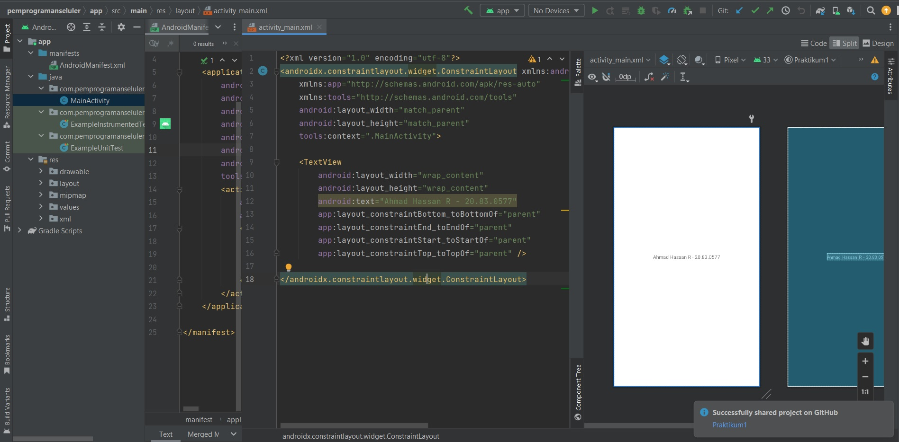

# Praktikum 1 - Pemprograman Seluler
Tugas
1. Buatlah Akun github dengan email students anda.
2. Ubahlah teks yang ada pada activiy_main.xml menjadi nama lengkap anda.
Lakukan commit kemudian push ke repository GitHub yang telah anda buat.
Kumpulkan link dan screenshoot github anda ke Classroom.

